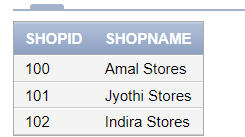
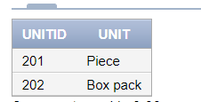
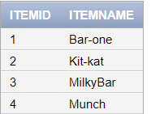
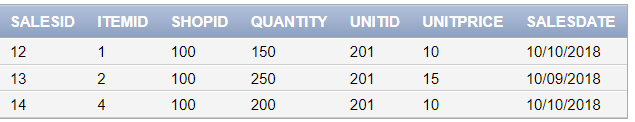

# 
```
CREATE TABLE shop2(
shopid INT PRIMARY KEY,
shopname VARCHAR(20)
)

INSERT ALL
INTO shop2(shopid,shopname) VALUES (100,'Amal Stores')
INTO shop2(shopid,shopname) VALUES (101,'Jyothi Stores')
INTO shop2(shopid,shopname) VALUES (102,'Indira Stores')
SELECT * FROM DUAL

select * FROM shop2
```



```
CREATE TABLE unit2(
unitid INT PRIMARY KEY,
unit VARCHAR(10)
)
INSERT ALL
INTO unit2(unitid,unit) VALUES (201,'Piece')
INTO unit2(unitid,unit) VALUES (202,'Box pack')
SELECT * FROM DUAL

select * from unit2
```



```

CREATE TABLE item3(
itemid INT PRIMARY KEY,
itemname VARCHAR(20)
)

INSERT ALL
INTO item3(itemid,itemname) VALUES (01,'Bar-one')
INTO item3(itemid,itemname) VALUES (02,'Kit-kat')
INTO item3(itemid,itemname) VALUES (03,'MilkyBar')
INTO item3(itemid,itemname) VALUES (04,'Munch')

SELECT * FROM DUAL

select * from item3
```



```
CREATE TABLE sales5(
salesid INT PRIMARY KEY,
itemid INT,
shopid INT,
quantity INT,
unitid INT,
unitprice INT,
salesdate DATE,
FOREIGN KEY(shopid) REFERENCES shop2(shopid),
FOREIGN KEY(unitid) REFERENCES unit2(unitid),
FOREIGN KEY(itemid) REFERENCES item3(itemid)
)
INSERT ALL
INTO sales5(salesid, itemid, shopid, quantity, unitid, unitprice, salesdate) VALUES (12,01,100,150,201,10,TO_DATE('10-10-2018', 'DD-MM-YYYY'))
INTO sales5(salesid, itemid, shopid, quantity, unitid, unitprice, salesdate) VALUES (13,02,100,250,201,15,TO_DATE('09-10-2018', 'DD-MM-YYYY'))
INTO sales5(salesid, itemid, shopid, quantity, unitid, unitprice, salesdate) VALUES (14,04,100,200,201,10,TO_DATE('10-10-2018', 'DD-MM-YYYY'))
SELECT * FROM DUAL;


select * from sales5

```



